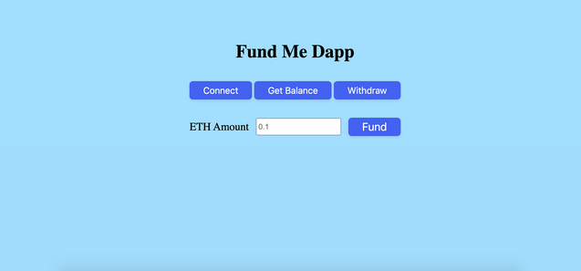

# Front-End to the Fund Me Dapp

A simple front-end to the Fund Me crowdfunding dapp.

## Getting Started

1. Clone the repo.

   ```
   git clone https://github.com/cryptoshuriken/fund-me-frontend
   cd fund-me-frontend
   ```

2. Run the file

Two ways to run the file:

- Double click the `index.html` file to run it in the browser.
- Open it in VS Code and run "Open with Live Server".

After it opens in the browser, you should see a similar webpage:



Hit the "Connect" button and you should see Metamask pop up.

## Execute a Transaction

If you want to execute a transaction, follow the following steps:

1. Make sure you have the back-end Dapp installed (repo [here](https://github.com/cryptoshuriken/fund-me-hardhat)):

```
git clone https://github.com/cryptoshuriken/fund-me-hardhat
cd fund-me-hardhat
```

2. Either deploy the smart contract to the Goerli testnet by providing the RPC URL and private key in a `.env` file, or deploy it to a local hardhat node.

To deploy it to a local hardhat node, run:

```
yarn hardhat node
```

3. Update your `constants.js` with the new contract address.
   In your constants.js file, update the variable contractAddress with the address of the deployed "FundMe" contract. You'll see it near the top of the hardhat output.

4. Connect Metamask to your Local Hardhat blockchain.
   > PLEASE USE A METAMASK ACCOUNT THAT ISNT ASSOCIATED WITH ANY REAL MONEY. I usually use a few different browser profiles to separate my metamasks easily.

To connect Metamask to a local blockchain, grab a private key from one of the fake accounts that Hardhat provided when you ran `yarn hardhat node` and then [import it into your Metamask](https://metamask.zendesk.com/hc/en-us/articles/360015489331-How-to-import-an-Account).

5. Hit the `Connect` button on the front-end of the app.


6. Enter an `ETH Amount` and hit the `Fund` button.


7. Interact with the smart contract with the `Get Balance` and `Withdraw` buttons, and have fun!
